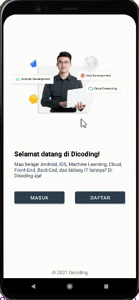
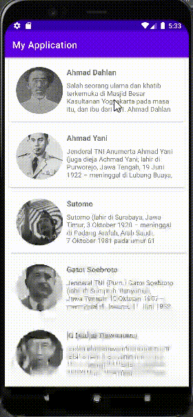
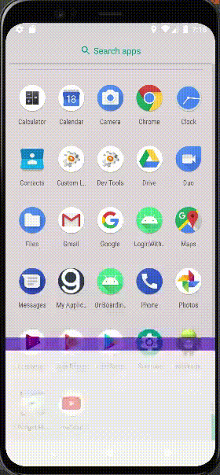

# Belajar Pengembangan Aplikasi Android Intermediate

## Table of Contents

1. [Advanced UI](#advanced-ui)
2. [Animation](#animation)

## Advanced UI

On progress

## Animation

| #      | Description | Preview |
| ----------- | ----------- | ----------- |
| 1      | Latihan Property Animation |  |
| 2   | Latihan Activity Transition dan Shared Element |  |
| 3   | Latihan Motion Layout |  |
